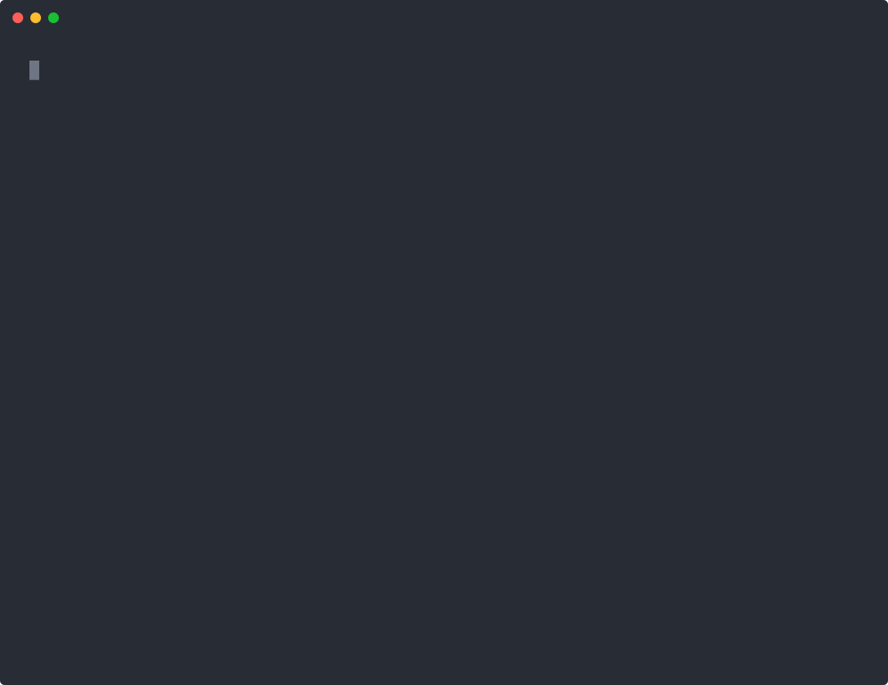

<div align="center">

<a href="https://yungle.co?ref=github"></a>

# Yungle for developers

**Send large files from your terminal, your scripts and your AI assistant.**<br>
Private, EU-hosted file transfer: a WeTransfer alternative with a CLI, an MCP server, typed SDKs and webhooks.

[](https://www.npmjs.com/package/yungle-cli)
[](https://www.npmjs.com/package/yungle-mcp)
[](https://www.npmjs.com/package/yungle-client)
[](https://github.com/heindewilde/yungle-clients/actions/workflows/ci.yml)
[](LICENSE)

[Website](https://yungle.co?ref=github) · [Docs](https://yungle.co/developers?ref=github) · [API reference](https://yungle.co/developers/reference?ref=github) · [CLI](apps/cli) · [MCP](packages/mcp-server) · [TypeScript](packages/api-client) · [Python](python)

<br>



</div>

<br>

```bash
npm install -g yungle-cli
yungle login                  # opens your browser, once
yungle send ./render.mov      # uploads resumably, prints the link
```

Want Yungle to email the link for you? Sign in with an API key (`yungle login --key`) and add
`--to client@example.com`. A browser sign-in makes links but never emails anyone, so a phished
sign-in code can't be used to mail strangers.

## What's in here

| | Install | What it's for |
|---|---|---|
| **[CLI](apps/cli)** | `npm i -g yungle-cli`<br>`brew install heindewilde/yungle/yungle` | Send, receive and sync files from a terminal or CI. Resumes after a dropped connection or a closed lid |
| **[MCP server](packages/mcp-server)** | [In Claude's directory](https://claude.ai/directory/yungle)<br>`https://yungle.co/mcp` | Connect Claude, Cursor or any MCP client with one sign-in: ask what arrived, share files, approve every send |
| **[TypeScript SDK](packages/api-client)** | `npm i yungle-client` | The whole API, typed and dependency-free. Node, Bun, Deno, edge runtimes |
| **[Python SDK](python)** | `pip install yungle` | The API from Python, with a one-call `send()` that handles the upload |
| **[GitHub Action](https://github.com/heindewilde/yungle-send-action)** | `uses: heindewilde/yungle-send-action@v1` | Send build artefacts to a client from CI and get the link back as an output |
| **[Examples](examples)** | | GitHub Actions, nightly reports, and more at [yungle.co/developers/recipes](https://yungle.co/developers/recipes?ref=github) |

All of it talks to the same public [REST API](https://yungle.co/developers/reference?ref=github)
([OpenAPI 3.1](https://yungle.co/api/v1/openapi.json)), which CI checks these clients against
on every change.

## The CLI

Built to be pleasant for a person and predictable for a script. Pretty at a terminal, just the
link when piped, JSON with `--json`.

```bash
yungle send ~/Shoot --to anna@studio.nl --message "Final selects"   # send a folder
yungle send dist/ --json | jq -r .url                               # in a script
yungle get https://yungle.co/t/emerald-palm-a5mt                    # download, no account needed
yungle status                                                       # who downloaded what
yungle watch ~/Renders --collection 01J8Z3M9Q0W4                    # upload new files as they land
yungle webhooks listen --forward-to http://localhost:8080/hooks     # test webhooks locally
```

- **Resumable, big uploads.** Interrupt `yungle send`, run it again, and it continues from the
  last committed part instead of starting over.
- **Guided when you leave something out.** `yungle send` on its own asks what to send and to
  whom. Never in CI, never with `--json` or `--yes`: a script can't hang on a question.
- **Errors tell you the fix.** Every failure ends with the one command that gets you unstuck,
  and a typo gets a *did you mean*.
- **Tab completion** for zsh, bash and fish: `yungle completion zsh`.

Full reference: [apps/cli](apps/cli) · [yungle.co/developers/cli](https://yungle.co/developers/cli?ref=github)

## Connect your AI assistant

**In Claude:** [add Yungle from Claude's connector directory](https://claude.ai/directory/yungle) and sign in.

**Anywhere else** (Cursor, VS Code, any MCP client): add Yungle as a remote MCP server and sign in once. No key to copy.

```
https://yungle.co/mcp
```

Then ask things like *"Did Anna download the final set?"*, *"Which deliveries expire this
week?"* or *"Share these three files with the client."* The assistant prepares; **you approve
every send** before an email leaves. There is no tool that deletes, revokes or invites, and
everything the server returns is labelled as untrusted data, because a filename can carry a
prompt injection.

Prefer a local server with an API key? `yungle mcp install` writes the config for Claude
Desktop, Claude Code, Cursor or Windsurf. Details: [packages/mcp-server](packages/mcp-server).

## The SDKs

```ts
import { YungleClient } from 'yungle-client';

const yungle = new YungleClient({ apiKey: process.env.YUNGLE_API_KEY! });
for await (const t of yungle.allTransfers()) console.log(t.title, t.downloadCount);
```

```python
from yungle import Yungle

sent = Yungle().send(["render.mov"], to=["client@example.com"], message="Final cut")
print(sent["url"])
```

Both retry what is safe to retry, put an `Idempotency-Key` on every POST so a retry never makes
a second copy, follow cursor pagination for you, and verify webhook signatures.

## Webhooks

Get told instead of polling: `transfer.ready`, `transfer.downloaded`, `transfer.expiring`,
`transfer.expired`, and on paid plans `collection.file_uploaded`. Each delivery is signed with
HMAC-SHA256 and retried with backoff. No public URL? Leave it out and pull the events instead.

```ts
import { verifyWebhook } from 'yungle-client';
const ok = await verifyWebhook(rawBody, req.headers['yungle-signature'], process.env.YUNGLE_WEBHOOK_SECRET!);
```

## Plans and limits

Every account can use the API, the CLI and the MCP server, **the free plan included**:
transfers up to 10 GB, contacts, webhooks, and downloading any link. Collections and files
that never expire come with a paid plan. The first 10 GB of API uploads each month are free,
then €0.02/GB from prepaid credit. [Pricing](https://yungle.co/pricing?ref=github)

## Why Yungle

- **In Europe, run by a European company.** Your files are stored and served from EU
  infrastructure.
- **Always encrypted.** Every file gets its own key, and transfers can be end-to-end encrypted
  in the browser when you need it.
- **Sustainable.** Renewable hydropower, in a data centre with a PUE of 1.13.
  [What that does and doesn't mean](https://yungle.co/sustainability?ref=github).

**Not reachable from here:** your vault and end-to-end encrypted transfers. Their keys are
derived in your browser and never sent to Yungle, so no API can read them. See
[what the API can't do](https://yungle.co/developers/unsupported?ref=github).

## Contributing

```bash
pnpm install
pnpm typecheck && pnpm lint && pnpm test && pnpm build
pnpm contract   # check the clients against the live OpenAPI spec
```

This repository is where the clients are developed; the Yungle service itself is not open
source. Issues and pull requests are welcome, see [CONTRIBUTING.md](CONTRIBUTING.md). Security
reports go through [security.txt](https://yungle.co/.well-known/security.txt).

MIT
